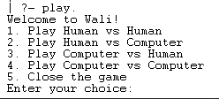
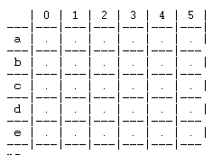
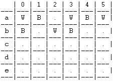

# Wali_3
## Members
### Rui Filipe Cunha Pires 
- up202008252 
- Contribution: 50%
### Guilherme Valler Moreira
- up202007036 
- Contribution: 50%

## Installation and Execution
### Installation
When it comes to installing the project, you just have to install the following files:
- Project's Source code
### Execution
To execute the project, you need to have the following installed:
- Sicstus Prolog 4.7.1

Then you simply press consult on the file "main.pl" located in the "src" folder.

After that type play. in the Sicstus console and the game will start.

## Game Description

### Brief Description
- The game is a 2 player game, where each player has a set of stones (black and white) and a goal to reach.
- There is two phases in the game, the first one is the placement phase, where each player has to place their stones on the board.
- The second one is the movement phase, where each player has to move their stones on the board to try and make 3 stones of the same color in a row or column, so that they can eliminate the other player's stones.

- The goal of the game is to eliminate all the other player's stones.

### Rules
- The game is played on a 5x6 board.
- Player 1 has 12 white stones and player 2 has 12 black stones.
#### First Phase
- During the first phase stones can only be placed in squares that are not occupied by another stone, and those squares cannot be adjacent to stones of the same color (diagonals are not considered adjacent).
- In order for the first phase to end, both players have to place all their stones on the board or both players have ro run out of valid moves.
- If a player runs out of valid moves, the other player can still place their stones on the board until they run out of valid moves or they place all their stones on the board.

#### Second Phase
- During the second phase stones can only be moved to adjacent squares (diagonals are not considered adjacent), who are not occupied by another stone.
- If during a player's turn, they manage to place exactly 3 stones of the same color in a row or column, they can eliminate one of the other player's stones.
- When one of the players has no more stones on the board, the other player wins the game.

#### References
- https://www.di.fc.ul.pt/~jpn/gv/wali.htm
- https://boardgamegeek.com/boardgame/66351/wali

## Game Logic

### Internal representation of the game state
- The game state is represented by a list of 5 lists, each one representing a row of the board.
- Each one of those 5 lists has 6 elements, each one representing a column of the board.
- Each one of those 6 elements can be either empty, black or white.
- Initially we start with all the 30 squares of the board occupied by empty elements.

```
emptyBoard([[empty,empty,empty,empty,empty,empty],
            [empty,empty,empty,empty,empty,empty],
            [empty,empty,empty,empty,empty,empty],
            [empty,empty,empty,empty,empty,empty],
            [empty,empty,empty,empty,empty,empty]]).
```
- A board filled with stones would look like this:
```
middleGameBoard([[white,black,white,black,white,black],
                   [empty,empty,empty,empty,empty,empty],
                   [black,white,black,white,black,white],
                   [empty,empty,empty,empty,empty,empty],
                   [white,black,white,black,white,black]]).
```
- Finally a board with player2 eliminated would look like this:
```
endGameBoard([[empty,white,white,white,empty,empty],
              [empty,empty,white,empty,empty,empty],
              [empty,empty,empty,empty,empty,empty],
              [empty,empty,empty,empty,empty,empty],
              [empty,empty,empty,empty,empty,empty]]).
```
- Notice than the winning player needs to still posess at least three stones in order to win the game.
- Also worth noting that white finishes the game with 3 stones in a row, as this allows them to eliminate the last black stone.

### Game state view

#### Menu
- The menu is the first thing that the user sees when they start the game.
- It is displayed by the predicate menu/0.
- It has 5 options:
    - Play Human vs Human
    - Play Human vs Computer
    - Play Computer vs Human
    - Play Computer vs Computer
    - Exit
- The first 4 options are self explanatory, they allow the user to play the game with either 2 humans or 2 computers or a human and a computer.
- The last option allows the user to exit the game.
- Here is how the menu looks like:



#### Board

- The board is displayed by the predicate displayGame(+Board)
- It is displayed after each player's turn.
- Receives the game state as a parameter.
- It is displayed as a 5x6 grid, where each square is either empty, black or white.
- Here is how the empty board looks like:



- Here is how the board with stones looks like:



### Moves execution
- The execution of the moves is handled by the predicate move/9.
- It receives the following parameters:
    - Player: The player who is playing the turn.
    - Board: The current game state.
    - NewBoard: The new game state after the move is executed.
    - WhiteSpots: The valid spots where the player can place a white stone.
    - NewWhiteSpots: The valid spots where the player can place a white stone after the move is executed.
    - BlackSpots: The valid spots where the player can place a black stone.
    - NewBlackSpots: The valid spots where the player can place a black stone after the move is executed.
    - LevelWhite: The level of the white player (0 if it is a human, 1 if it is the easy computer, 2 if it is the hard computer).
    - LevelBlack: The level of the black player (0 if it is a human, 1 if it is the easy computer, 2 if it is the hard computer).
- It is responsible for executing the moves of the players.
- It also calls the predicates responsible for validating moves, 
such as checkPlayer1Move/11, checkPlayer2Move/11, checkStone/2, 
checkRemove/10.

### List of valid moves
- The list of valid moves is handled by the predicate validMoves(+Board, +Color, -ValidMoves).
- It receives the following parameters:
    - Board: The current game state.
    - Color: The color of the player who is playing the turn.
    - ValidMoves: The list of valid moves for the player.
- It is responsible for generating the list of valid moves for the player.
- It is super important because the computer uses this list to decide which move to make.
- In the case of the first phase, we use the predicates whiteSpots and blackSpots to help us generate the list of valid moves, as they return the list of valid spots where the player can place a stone.

### End of Game
- The end of the game is handled by the predicate game_over(+Board).
- It receives the following parameters:
    - Board: The current game state.
- It is responsible for checking if the game is over.
- It is called after each player's turn on the second phase.
- After the game is over, it simply displays the winner.

### Computer moves

#### Easy Computer
- The predicate chooseMove(+Board, +Valid, +Color, +Level, -Move) is responsible for choosing the move that the computer will make.
- In this easy computer, we simply choose a random move from the list of valid moves, both in the first and second phase.
#### Hard Computer
- In the first phase, the hard computer tries to place their stones adjacent to the other player's stones, so it's harder for them to make a row or column of 3 stones.
- In the second phase, the hard computer tries to make a row or column of 3 stones, so it can eliminate one of the other player's stones.
## Conclusion
- This project was a really hard challenge for us, as we found it really difficult to implement the game logic.
- There were some things we couldn't implement, such as:
    - The fact a player must only have 3 stones in a row or column to eliminate an enemy stone and not more than that (e.g. a player with 4 stones in a row can't eliminate an enemy stone).
    - The fact that a player can't eliminate an enemy stone if remove a 4th stone from the row or column where the 3 stones are, because that move counts as a move to make a row or column of 3 stones.
- If we had to implement this project again, we would probably try to implement the game logic in a different way, as we found it really hard to implement the game logic in the way we did.
- We would also try to rethink the predicates we used to validate moves, as we found them really hard to implement, specially in the second phase.
- To conclude, even though we didn't manage to implement everything we wanted, the end result was still very satisfying, as we managed to implement a working game.

## Bibliography

- https://www.di.fc.ul.pt/~jpn/gv/wali.htm
- https://boardgamegeek.com/boardgame/66351/wali
- https://sicstus.sics.se/
